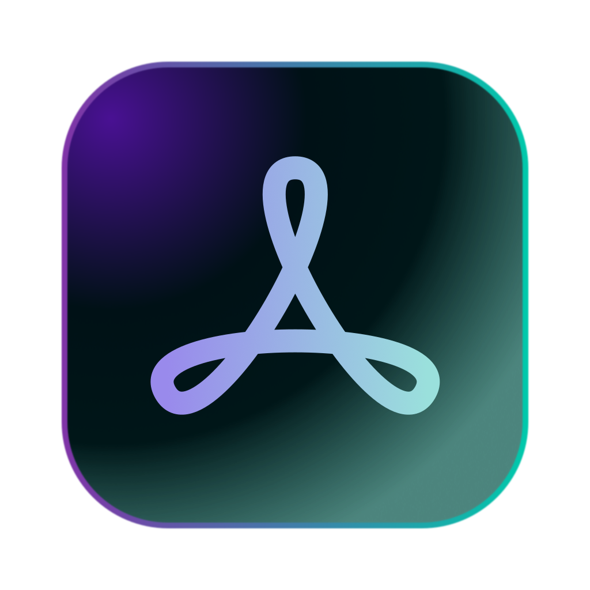

  

<h1 align="center">Ainto</h1>

  A lightweight, open-source macOS launcher with built-in AI integration. 
  <em>The Spotlight & Raycast alternative for engineers who keep it simple.</em>

  <a href="https://ainto.app">Website</a> &middot;
  <a href="https://github.com/ainto-labs/ainto-app">Source Code</a>

---

### Why Ainto?

Most launchers ship dozens of features you'll never touch — window management, calendar widgets, currency converters, note-taking, and more.

**Do you really need all that?**

Ainto takes a different approach: stay lightweight, launch apps fast, and integrate the one tool that actually multiplies your productivity — **AI**.

Press `Tab` to chat with AI right inside your launcher. Search, launch, ask — all from one keystroke. For a software engineer, that's more than enough.

### What's inside

- **App Search** — Fuzzy matching with frecency ranking. Results improve as you use them.
- **AI Chat** — Press `Tab` to ask AI anything. No browser, no context switch.
- **Clipboard History** — Text, images, files. Searchable and persistent.
- **Snippets** — Type a keyword, expand to anything. Dynamic placeholders like `{date}` and `{clipboard}`.
- **AI Commands** — Select text anywhere, run Fix Grammar / Translate / Summarize instantly.

### Built with

SwiftUI + AppKit frontend. Rust core library. Connected over C FFI. No Electron. No web views. Native and fast.

### Coming soon

Ainto is under active development. Signed builds will be available via [GitHub Releases](https://github.com/ainto-labs/ainto-app/releases).
